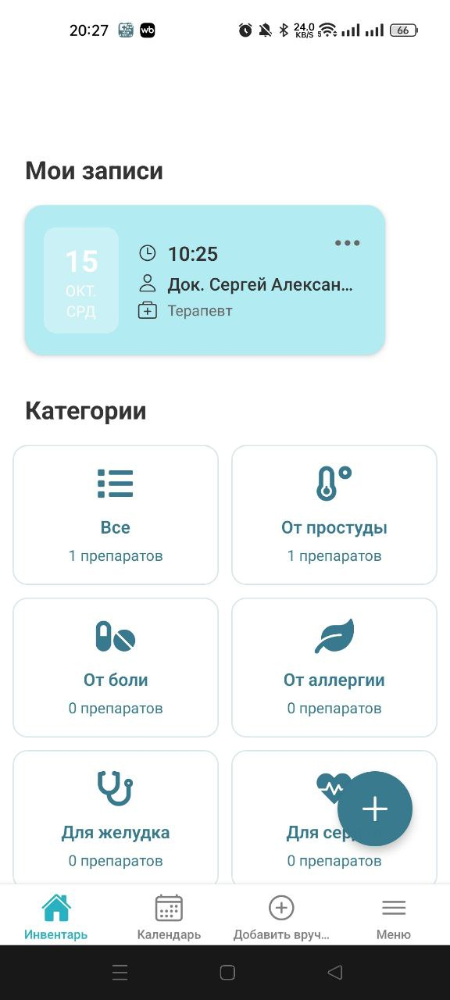
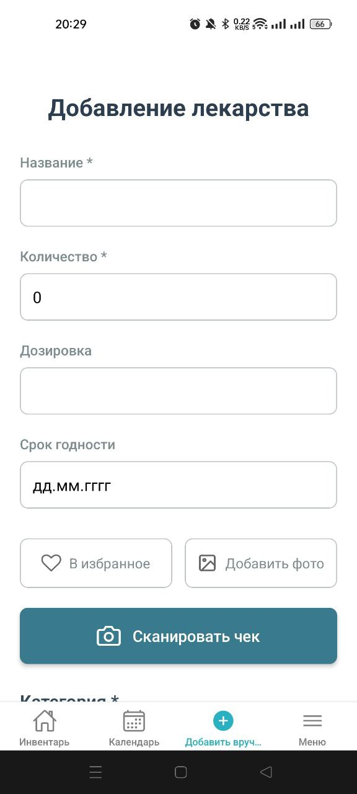
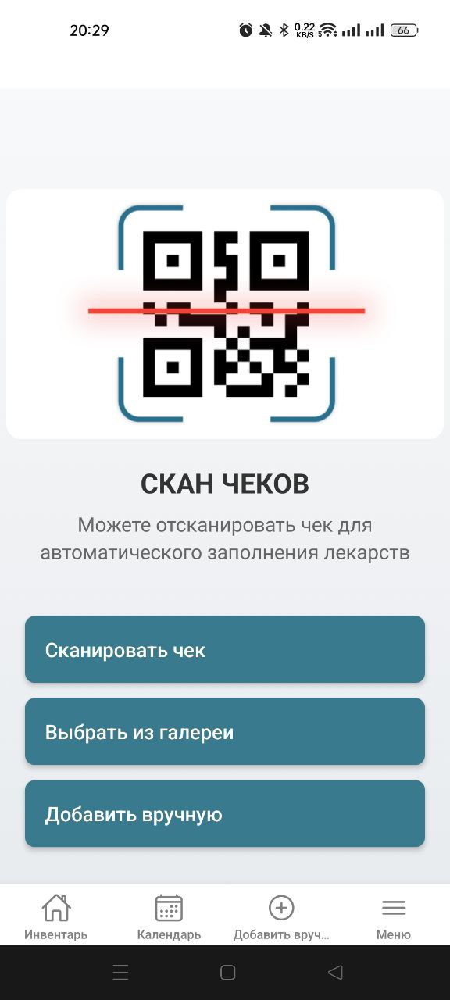
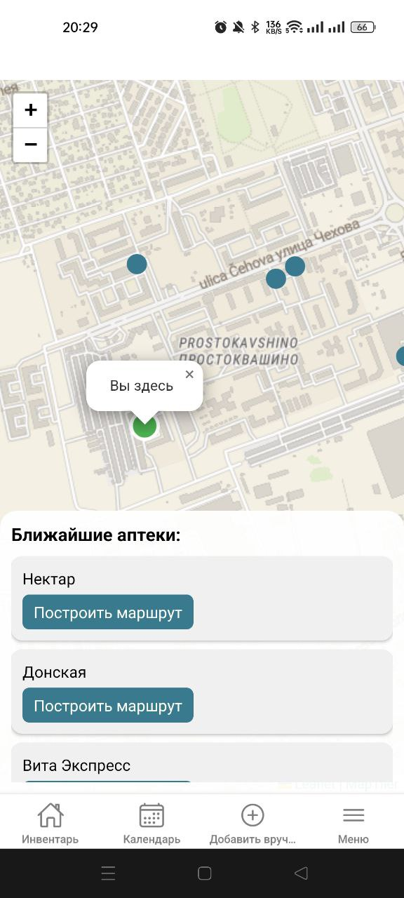
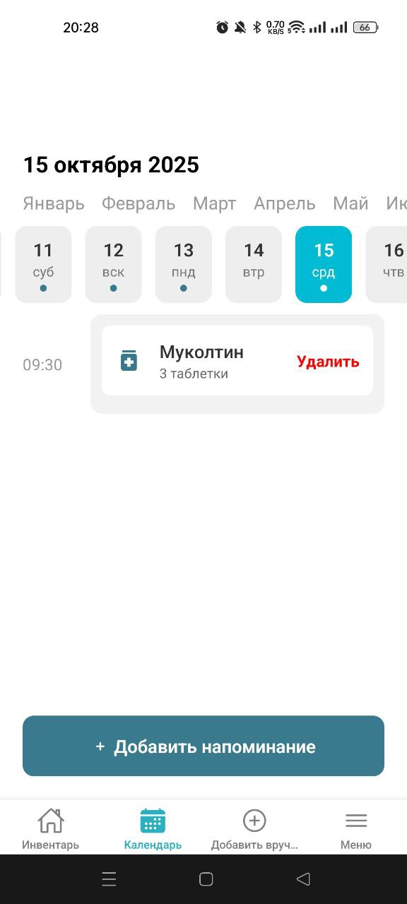

# 💊 Моя Аптечка — приложение для инвентаризации лекарств

> Удобное приложение для учёта, хранения и контроля срока годности лекарств дома.

---

## 🧭 Описание проекта

**Моя Аптечка** — это приложение, которое помогает пользователям:
- хранить информацию о своих лекарствах,
- отслеживать сроки годности,
- получать напоминания о пополнении,
- быстро находить нужное средство в аптечке.

---

## ⚙️ Основной функционал

- 📦 Добавление лекарств с указанием:
  - названия, дозировки, формы выпуска, количества;
  - срока годности и даты приобретения;
- 🔔 Уведомления о скором истечении срока;
- 🏷️ Категории лекарств (анальгетики, витамины, антисептики и т.д.);
- 📸 Возможность прикреплять фото упаковки;

---

## 🖼️ Скриншоты

| Экран | Описание |
|-------|-----------|
|  Главная страница с перечнем лекарств |
|  | Форма добавления нового лекарства |
|  | Сканирование чеков из аптек |
|  | В радиусе 1 км.|
|  | Пользователь вносит название препората, дозу и дату приема|

---

## 🧩 Технологии
(пример — обновим после анализа кода)
- 📱 React Native / Flutter / Android SDK  

---

## 🚀 Установка и запуск

```bash
git clone https://github.com/TankistVova/InProject.git
cd InProject
npm install
npm start